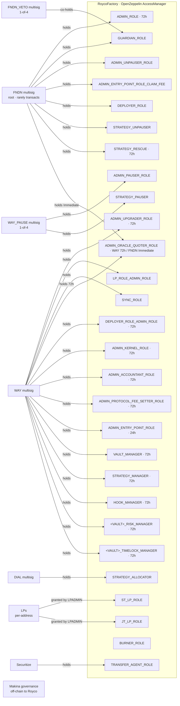
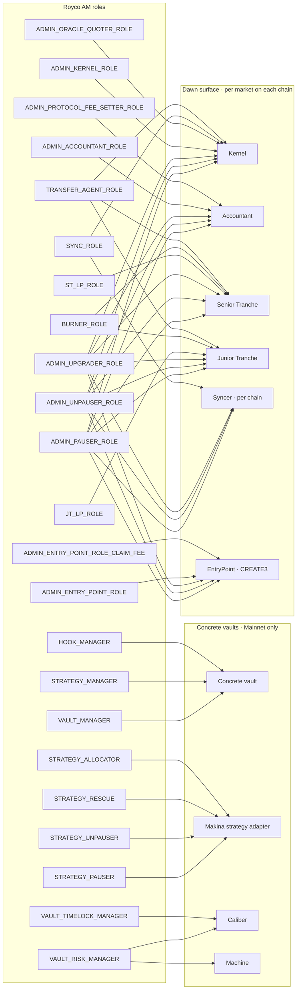
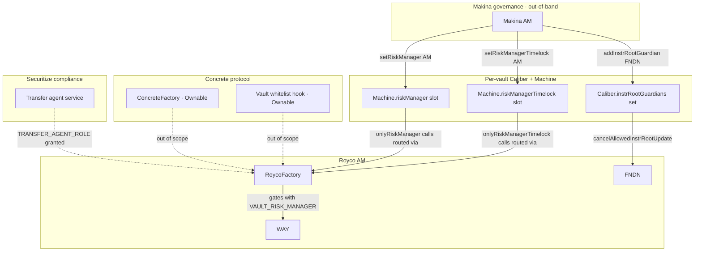

# Ownership / control structure

Single-page view of every contract Royco controls or depends on, plus who can call what.

## Actors → AM roles

## AM roles → contracts they gate

## Cross-organization dependencies

## Key

- **Solid arrows** = on-chain authority paths (who can call what).
- **Dashed arrows** = out-of-scope dependencies (Royco depends on but doesn't control).
- Delays are noted on roles in the actor diagram; default is Immediate.
- Per-vault roles (`<VAULT>_RISK_MANAGER`, `<VAULT>_TIMELOCK_MANAGER`) collapse to a single node here for readability — there's actually one of each per concrete vault (`SRROYUSDC_*`, `ROYWSTETH_*`).
